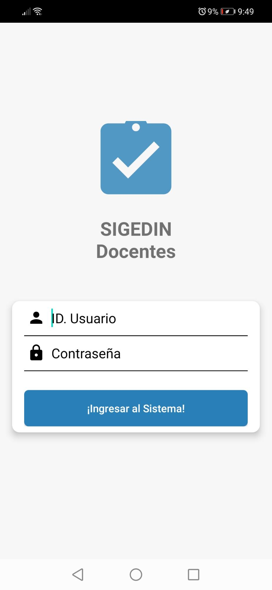
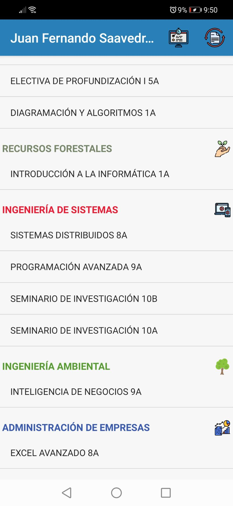
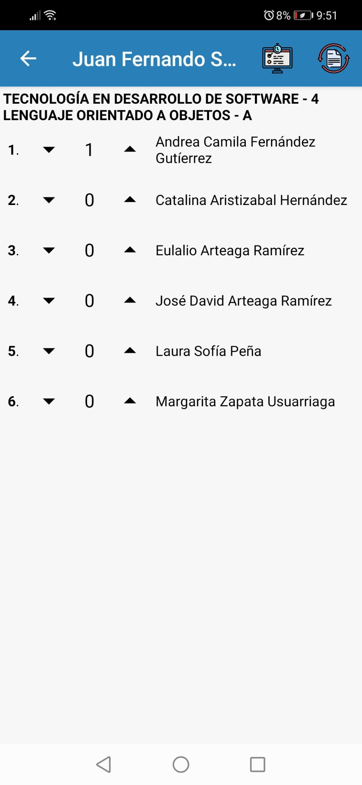
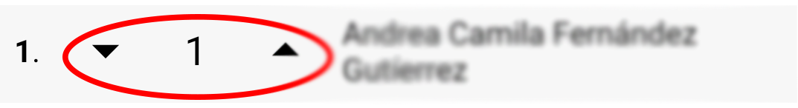
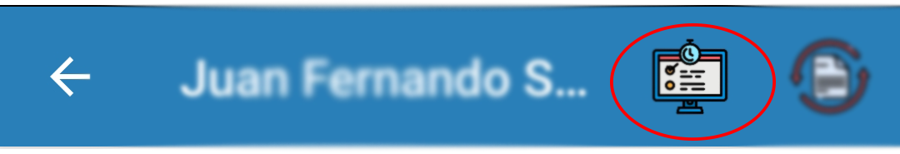
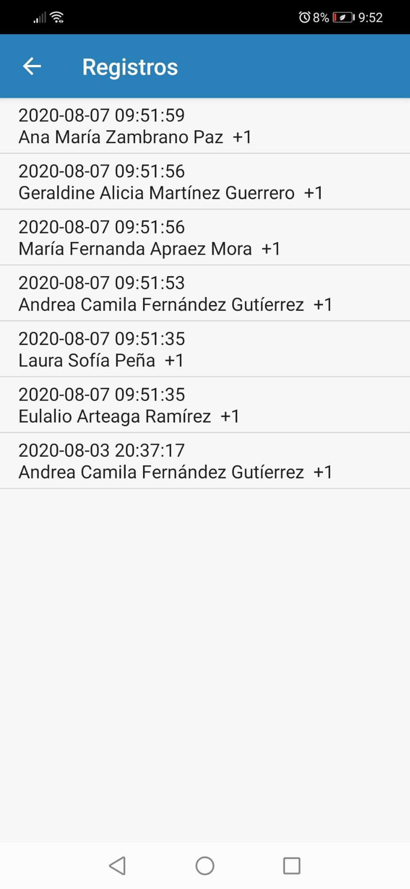
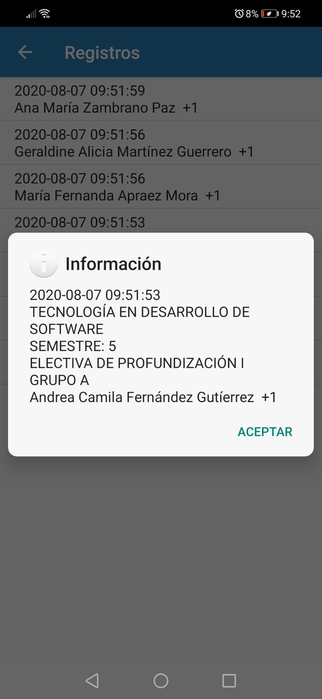
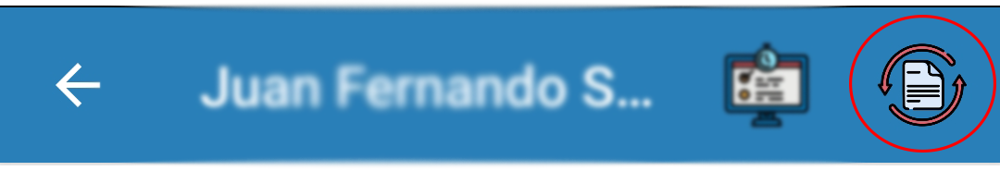
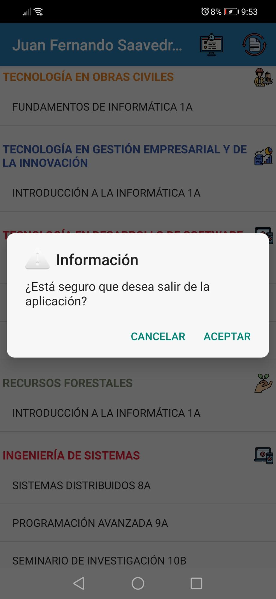

MANUAL DE USUARIO

Contenido

[INSTALACIÓN](#h.gjdgxs)        [3](#h.gjdgxs)

[FUNCIONAMIENTO](#h.30j0zll)        [4](#h.30j0zll)

[Inicio de sesión](#h.i357jcpv502z)        [4](#h.i357jcpv502z)

[Lista de Unidades de Formación según
Programa](#h.sr56916ya1u3)        [6](#h.sr56916ya1u3)

[Listado de Estudiantes según Unidad de
Formación](#h.1w5fybfgrabk)        [9](#h.1w5fybfgrabk)

[Bitácora](#h.hqnhs6hapgwx)        [11](#h.hqnhs6hapgwx)

[Sincronización](#h.cnj5lzltku25)        [13](#h.cnj5lzltku25)

[Salir de la Aplicación](#h.ddegxk3glv29)        [14](#h.ddegxk3glv29)

INTRODUCCIÓN

El propósito de este manual de usuario, es brindar la información
necesaria para el manejo adecuado de la aplicación, ilustrar sobre sus
funcionalidades y todo lo relacionado desde su instalación.

1.  INSTALACIÓN {#h.gjdgxs style="display:inline"}
    ===========

Para instalar la aplicación se debe contar con el archivo de instalación
APK el cual aún no se define desde donde se podrá descargar.

Teniendo este archivo se debe ejecutarlo en el móvil y este iniciará a
instalarse en el dispositivo automáticamente. Es necesario que para la
instalación de archivos apk por fuera de la PlayStore de Google dar los
permisos necesarios desde el panel de configuración de Android, para
ello revisar el siguiente enlace ya que el proceso puede variar
dependiendo de la versión del sistema operativo:
[https://es.digitaltrends.com/guias/instalar-app-android-fuera-play-store/](https://www.google.com/url?q=https://es.digitaltrends.com/guias/instalar-app-android-fuera-play-store/&sa=D&ust=1596845856696000&usg=AOvVaw2CFsu7rdYP_Y04gb8HpFsc)

2.  FUNCIONAMIENTO {#h.30j0zll style="display:inline"}
    ==============

2.   Inicio de sesión {#h.i357jcpv502z style="display:inline"}
    -----------------

Para ejecutar la aplicación debe dar un toque en el icono de la misma.

Al ejecutar la aplicación, inicialmente se visualizará la siguiente
pantalla de carga durante 2 segundos:

Posteriormente se visualizará la pantalla donde se deberán ingresar las
credenciales de acceso a la aplicación, los cuales corresponden a los
mismos datos de acceso de la plataforma SIGEDIN.

-   En el campo ID. Usuario se debe digitar la identificación del
    docente.
-   En el campo Contraseña se debe digitar la contraseña que
    corresponde.
-   Posteriormente dar un toque al botón ¡Ingresar al Sistema!

3.   Lista de Unidades de Formación según Programa {#h.sr56916ya1u3 style="display:inline"}
    ----------------------------------------------

Al ingresar los datos correctamente la aplicación redirigirá al usuario
a la pantalla principal donde visualizará en una lista las unidades de
formación que tenga asignadas, en caso de ingresar datos incorrectos la
aplicación arrojará un mensaje indicando el error en los datos. También
se debe tener en cuenta que es necesario diligenciar ambos campos puesto
que si no se llenan, la aplicación indicará un mensaje de error al
usuario para que diligencie los campos correspondientes.

La siguiente pantalla se refiere al listado de unidades de formación del
usuario:

4.   Listado de Estudiantes según Unidad de Formación {#h.1w5fybfgrabk style="display:inline"}
    -------------------------------------------------

El sistema se encargará de generar el listado dinámicamente y mostrará
las unidades de formación según el programa al que pertenezcan como se
indica en las anteriores imágenes.

El usuario debe elegir la unidad de formación de la que quiere obtener
el listado de estudiantes dando un toque, la aplicación lo dirigirá al
listado correspondiente, tal como se indica a continuación:

En esta pantalla el usuario obtendrá el listado de estudiantes
actualizado según la información suministrada por SIGEDIN a la
aplicación móvil. Al lado izquierdo de cada fila, junto al nombre de los
estudiantes, se ubican dos controles para contabilizar las inasistencias
de los estudiantes:

El control izquierdo decrementa el contador y el derecho lo incrementa.
Es importante tener en cuenta que una vez se modifique el contabilizador
de faltas, la aplicación almacenará automáticamente este valor en la
base de datos local.

Nota: No se reportan las inasistencias contabilizadas en la aplicación
al SIGEDIN, es necesario diligenciar los formatos en los que se reportan
dichas faltas.

5.  Bitácora {#h.hqnhs6hapgwx style="display:inline"}
    --------

Para acceder a la bitácora se debe dar clic en el botón presente en el
menú de navegación:

En caso de reclamo por alguna falta aplicada a algún estudiante, el
sistema cuenta con un módulo donde lleva un registro de todas las faltas
impuestas con datos que permitirán al docente saber datos como:

-   Fecha y hora de haber registrado la inasistencia.
-   Nombre del Estudiante.
-   Cantidad de faltas registradas.

Al dar clic en el registro de interés el sistema mostrará información
más avanzada sobre el mismo:

-   Programa académico al que pertenece el estudiante.
-   Semestre.
-   Unidad de formación.
-   Grupo.
-   Nombre completo del estudiante.
-   Registro de adición o eliminación de alguna inasistencia.

6.   Sincronización {#h.cnj5lzltku25 style="display:inline"}
    ---------------

La aplicación tiene la funcionalidad de sincronizar los datos más
recientes agregados a la plataforma SIGEDIN concerniente a los registros
de unidades de formación por parte de los estudiantes durante los
periodos correspondiente, o al retiro de alguno de estos igualmente.

Para mantener los listados actualizados es necesario tener acceso a
internet en el móvil y dar un toque en el botón de “sincronizar” ubicado
en la barra de menú de la aplicación.

Una vez se haya dado un toque al botón la aplicación realizará la
sincronización automáticamente y mostrará al usuario la información
actualizada.

7.   Salir de la Aplicación {#h.ddegxk3glv29 style="display:inline"}
    -----------------------

Para salir de la aplicación sólo es necesario dar un toque control de
atrás del menú del dispositivo móvil y la aplicación solicitará
confirmación al usuario.

